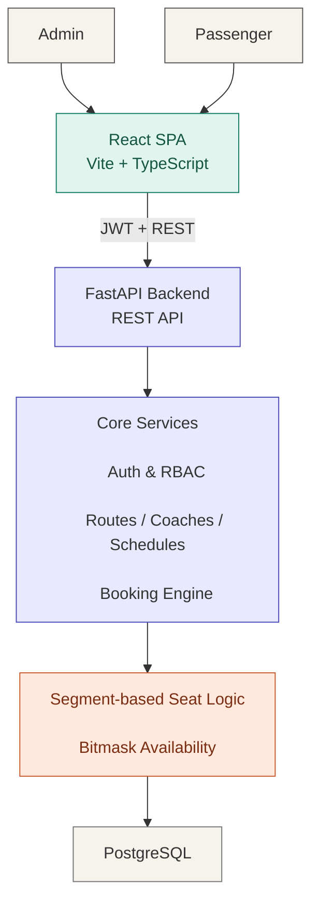

# Segment-Based Train Seat Booking System

---

A booking system for Sri Lanka's Colombo Fort–Badulla line that lets a single reserved seat be booked independently for multiple, non-overlapping legs of the same journey, so a seat vacated partway through the trip becomes available again for someone else, and each passenger is charged only for the distance they actually travel.

Watch the full system demonstration here:  
[Click to view the demo](https://youtu.be/bHhobTA8tlw)

## Table of Contents

- [Overview](#overview)
- [Architecture Diagram](#architecture-diagram)
- [Tech Stack](#tech-stack)
- [Running the Project](#running-the-project)
- [Core Design Decisions](#core-design-decisions)
- [Concurrency Correctness — Proof, Not Just Design](#concurrency-correctness--proof-not-just-design)
- [Alternatives Considered](#alternatives-considered)
- [Challenges Faced](#challenges-faced)
- [Extra Credit](#extra-credit)
- [Known Limitations / Future Work](#known-limitations--future-work)
- [Project Structure](#project-structure)

---

## Overview

🔹 In the current train reservation system, seats in reserved coaches are booked for the entire journey, even if a passenger travels only part of the route. As a result, once a passenger leaves the train, the seat remains unavailable for the rest of the journey, reducing seat utilization and requiring partial-journey passengers to pay higher fares to offset the unused capacity. 

🔹 This project addresses the issue by implementing a segment-based seat allocation approach, where seat occupancy is managed for each segment between consecutive stations instead of the entire route. This allows the same seat to be assigned to different passengers on non-overlapping journey segments while ensuring that passengers are charged only for the distance they travel.

**Roles:**
- **Admin** (single hardcoded account) - configures routes, stations, coaches, and schedules; views all bookings and system-wide seat maps
- **Passenger** (self-registers) - searches for a train, views seat availability for a specific leg, books a seat, views/cancels their own bookings

---

## Architecture Diagram



---

## Tech Stack

| Layer | Choice |
|---|---|
| Backend | FastAPI (Python) |
| Database | PostgreSQL |
| Frontend | React + Vite + TypeScript, Tailwind CSS |
| Auth | JWT (PyJWT), bcrypt password hashing |
| Containerization | Docker Compose (Postgres + backend + frontend, one command) |

--- 

## Running the Project

```bash
git clone <this-repo-url>
cd Train-Seat-Booking-System
cp .env.example .env
docker compose up -d --build
```

- Frontend: [http://localhost:5173](http://localhost:5173)
- Backend API docs (Swagger): [http://localhost:8000/docs](http://localhost:8000/docs)
- Adminer (DB inspection): [http://localhost:8080](http://localhost:8080)

The hardcoded admin account (see [Core Design Decisions](#authentication--rbac)) is seeded automatically on first backend startup — no manual setup step is needed to log in as admin.

---

## Core Design Decisions

## 1. Segment occupancy: a bitmask, not a booking-interval list

Each seat's occupancy for a scheduled train is represented by a single integer called `occupied_mask`, where each bit corresponds to a route segment (the section between two consecutive stations). When a passenger books a journey, the bits representing all segments they travel through are set in the mask. To determine whether a seat is available for a requested journey, the system performs a single bitwise AND operation between the seat's current occupancy mask and the requested journey's mask. If the result is zero, the requested segments are completely free; otherwise, the journey overlaps with an existing booking. 

Booking a seat updates the occupancy mask by setting the corresponding bits, while cancelling a booking clears those bits. These operations all **execute in constant time, O(1)**. Additionally, the bitmask size is determined dynamically from the number of stations on the route (`segment_count = station_count - 1`) rather than being hardcoded, allowing routes of different lengths to be supported without any code changes.

## 2. Fare calculation

The fare is calculated based on the actual distance travelled rather than the entire route. For each booked journey, the system sums the real distances of all travelled segments (`distance_from_previous_km`), multiplies the total by a fixed rate per kilometre, and then applies a multiplier based on the seat's coach class (1st, 2nd, or 3rd class). 

This ensures that passengers are charged only for the distance they travel, addressing the overcharging problem associated with fixed whole-route fares. It also provides different pricing across reserved coach classes, reflecting the varying levels of comfort instead of charging all reserved seats the same fare. To improve transparency, the system provides a `/schedules/{id}/seats/{seat_id}/fare` preview endpoint, allowing the frontend to display the exact ticket price before the booking is confirmed. The preview uses the same fare calculation and coach-class lookup as the booking process, ensuring that the displayed price always matches the final amount charged.

## 3. Concurrency: atomic conditional UPDATE

The seat availability check and the booking update are performed as a single atomic database operation like below SQL statement. 

```sql
UPDATE seat_availability
SET occupied_mask = occupied_mask | :new_mask
WHERE seat_id = :seat_id AND train_schedule_id = :schedule_id
  AND (occupied_mask & :new_mask) = 0
RETURNING occupied_mask;
```
*(This is the conceptual SQL; see `app/modules/bookings/service.py::create_booking` for the actual SQLAlchemy implementation.)*

This ensures that two concurrent booking requests for overlapping segments of the same seat cannot both succeed. The transaction that commits first updates the seat occupancy, while the other transaction fails because the `WHERE` condition no longer matches, resulting in zero affected rows. The API then returns a 409 Conflict response to indicate that the seat is no longer available for the requested journey. This approach works similarly to a compare-and-swap mechanism, where the update only succeeds if the current state still matches the expected condition. Instead of relying on explicit row locking (pessimistic locking) or handling database constraint failures, the system uses PostgreSQL's row-level MVCC behavior to guarantee consistency directly through the conditional update operation.

## 4. Authentication & RBAC

The system supports two user roles:  `admin` and `passenger`. There is only one administrator account, with its credentials defined in `app/config.py` and automatically seeded into the database in an idempotent manner whenever the backend starts. This design is intentional because the system requires a single back-office operator rather than a self-service admin management workflow.

Passengers can create accounts through the `/user/register` endpoint, which only allows the creation of passenger-role users. No public or internal API flow allows a client to request or assign the admin role, preventing unauthorized privilege escalation.

All bookings are associated with the authenticated user's `user_id` obtained from the JWT token instead of relying on a manually entered passenger name. This ensures that bookings cannot be incorrectly assigned to another person and allows passengers to **view and cancel only their own bookings**. These ownership checks are enforced at the backend level rather than depending only on frontend restrictions.

## 5. Configurability

The number of coaches, seats within each coach, and stations included in a route are fully configurable by admin through the API and UI rather than being fixed values in the code. The system dynamically handles different route lengths, coach types, and seat capacities, which has been verified through testing with routes containing different numbers of stations and coaches with varying configurations.

---

## Concurrency Correctness — Proof, Not Just Design

Since concurrency handling is a core requirement of the assignment, it is validated through live tests against a real PostgreSQL database. The tests located in `tests/live/` folder. The test suite covers three concurrent booking scenarios, each fired as genuinely simultaneous requests (separate connections, separate users, `asyncio.gather`) rather than sequential calls:

| Scenario | Result |
|---|---|
| Two adjacent (non-overlapping) legs on the same seat, booked concurrently | Both succeed |
| Two partially-overlapping (not identical) legs on the same seat, booked concurrently | Exactly one succeeds, one gets `409` |
| 25 identical concurrent booking attempts on the same seat/leg | Exactly one succeeds, 24 get `409` |

Run these yourself:
```bash
cd backend
python -m pytest tests/live/ -v
```
(requires the backend already running against Postgres — see [Running the Project](#running-the-project))

--- 

## Alternatives Considered

🔹 **Row-level locking using (`SELECT ... FOR UPDATE`)** was considered as an alternative to the atomic conditional UPDATE approach. However, the conditional update was chosen because it avoids an explicit lock–check–write sequence, reducing database round trips and keeping the implementation simpler while still providing the required correctness guarantees. Row-level locking may become more beneficial in scenarios with extremely high contention on a single database row, but that is not the expected usage pattern for this system, where booking requests are distributed across many different seats rather than thousands of requests targeting the same seat simultaneously.

🔹 **Database range types + exclusion constraints** (Postgres `int4range` + `EXCLUDE USING gist`) were considered as an alternative for preventing overlapping bookings at the database level. However, they were not used because journeys are always defined by fixed station-to-station segments. A bitmask provides a simpler and faster solution with constant-time (O(1)) overlap checks using bitwise operations while maintaining the same correctness.

🔹 **Serializable transaction isolation** was considered as another concurrency solution, but it would require additional retry handling in the application when conflicts occur. The atomic conditional update approach provides the required guarantee with less complexity.

🔹 **Auto-assigned seats vs. passenger-chosen seats** - the system allows passengers to select their preferred seat directly from the seat map, following the approach used by many real booking systems. This was a deliberate product choice rather than a technical limitation.

--- 

## Challenges Faced

- **CORS during frontend/backend integration**: Browser requests initially failed during the preflight `OPTIONS` check because CORS middleware was not configured. This was resolved by adding CORSMiddleware with an explicit allowed-origin configuration.- 
- **Provisioning order dependency**: `seat_availability` records are created only for seats that exist when a schedule is created. Therefore, coaches should be configured before creating schedules. This is a documented workflow constraint rather than a system bug.  
- **Concurrency testing accuracy**: an early version of this system's concurrency test ran against SQLite and technically "passed," but for the wrong reason SQLite's single-writer lock serializes all writes regardless of application logic, so the test proved nothing about the actual database-level guarantee. Switching the concurrency proof to run against real Postgres was necessary to make the test meaningful.

---

## Extra Credit

🔹 **Seat map visualization** : Implemented for both admin and passenger views. Seats are color-coded (free / partially booked / fully booked for the full route) and clicking a seat shows its exact booked segment ranges (e.g., "Colombo Fort → Kandy") as a plain list rather than a selection control, since the data is intended for viewing only.

🔹 **Admin booking view** : a filterable (by status, by date) table of all bookings, with a running total of confirmed-booking count and income (or cancelled-booking count and lost revenue, depending on the active filter), computed live from whatever's currently loaded rather than tracked separately.

🔹 **Fare Calculation**: The fare is calculated based on the actual distance travelled. For each booked journey, the system sums the real distances of all travelled segments, multiplies the total by a fixed rate per kilometre, and then applies a multiplier based on the seat's coach class (1st, 2nd, or 3rd class). 

---

## Known Limitations / Future Work

- No waitlisting for fully-booked segments.
- No real-time seat availability updates: The UI does not use push notifications or continuous polling to refresh seat availability. Instead, the system relies on the atomic booking process, where a 409 Conflict response handles cases where a seat becomes unavailable between viewing the seat map and confirming the booking. This keeps the implementation simpler while maintaining correctness.
- Database migrations: The current implementation uses `create_all` during application startup to create database tables. While this is sufficient for the current development stage, Alembic is already included as a dependency and should be configured before future schema changes are applied to databases containing real production data.

---

## Project Structure

```
├── backend/
│   ├── app/
│   │   ├── main.py              # app entrypoint, CORS, admin seeding
│   │   ├── config.py            # settings, hardcoded admin credentials
│   │   ├── core/                # segment math, JWT/password helpers, shared validation
│   │   ├── db/                  # SQLAlchemy models, session
│   │   ├── schemas/             # Pydantic request/response models
│   │   └── modules/             # one folder per domain: routes, coaches, schedules, availability, bookings, fares, auth
│   │                                    
│   ├── tests/
│   │   ├── live/                # Postgres-backed concurrency proof tests
│   │                   
│   ├── Dockerfile
│   └── requirements.txt
├── frontend/
│   ├── src/
│   │   ├── api/                  # one module per backend domain
│   │   ├── auth/                 # JWT context, route guards
│   │   ├── components/           # SeatMap, layout shells, shared UI
│   │   └── pages/
│   │       ├── admin/            # routes, schedules, seat map, bookings
│   │       └── passenger/        # search, seat map, confirm, my bookings
│   ├── Dockerfile
│   └── nginx.conf
└── docker-compose.yml
```
